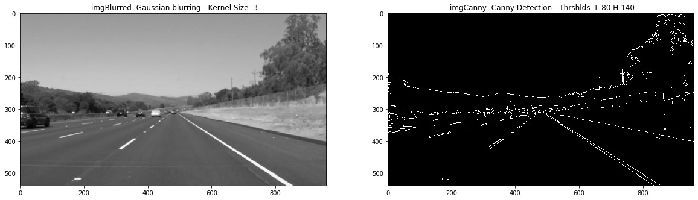
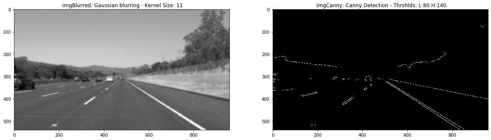
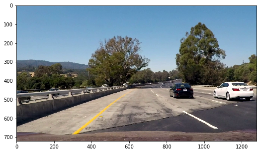
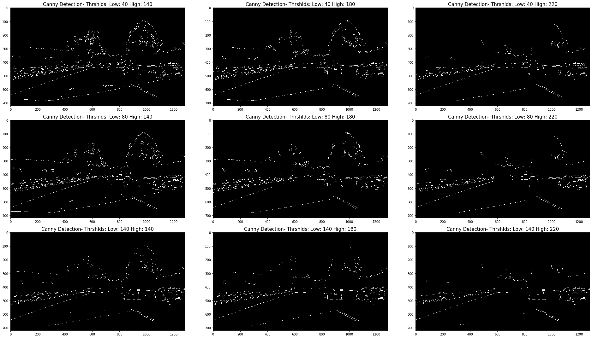
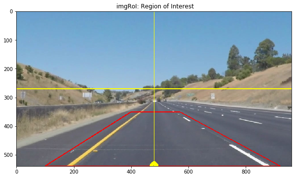
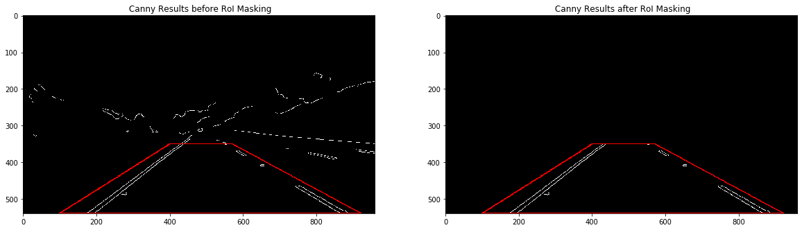
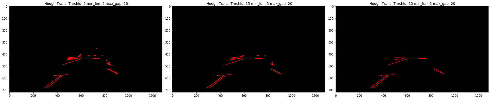
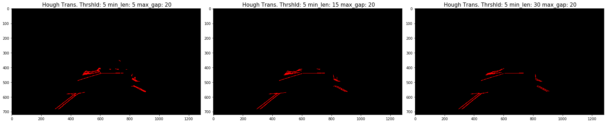
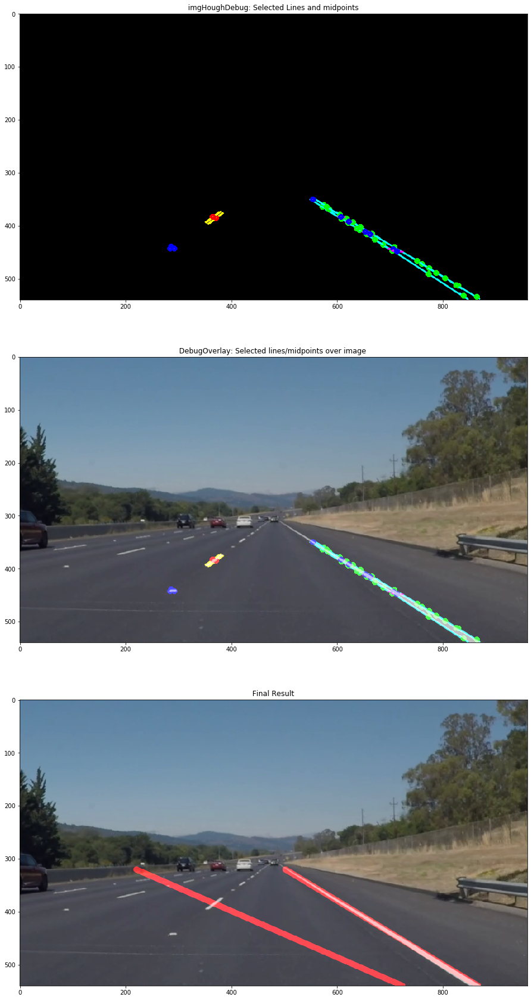
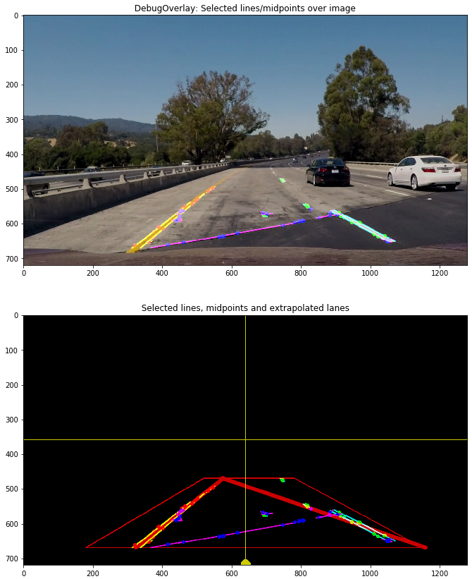

# **Finding Lane Lines on the Road**
Kevin Bardool 

The goals / steps of this writeup: 
* A brief review of the lane line detection pipeline
* Reflection on work - challenges encountered, possible improvements. 

---

## 1. Pipeline. 

As part of the description, explain how you modified the draw_lines() function.

The original pipeline consisted the following step:
#### Step 1: Grayscale conversion:
The image is converted to gray scale using the grayscale helper function. This function uses `cv2.cvtColor()` to convert the image.

#### Step 2: Gaussian Blurring
`gaussian_blur()` applies  a gaussian blurring operation on the image using the passed parameter kernel_size. Gaussian smoothing reduces noise and spurious gradients,and consequently line detections. The following images illustrate the effect of larger kernel sizes (i.e., increased Gaussian smoothing) on the results of the edge detection step. 

#### Step 3: Canny Edge Detection
In the next step the Canny transformation is applied for edge detection. 
Selection of the low and high threshold has an impact on what gradient shifts are detected as an edge.

##### Low Threshold  
Increasing the low threshold increases the number of 'weak edge pixels' that could be the result of noise and color variations. 

##### High Threshold 
The high threshold identifies the minimum intensity of the detected gradient necessary for the pixel to be considered a strong edge. 

The effect of various low and high thresholds on a challenging image (from the optional challenge video) are illustrated below. 

After testing various parameters, We selected a `lowThreshold` of 80 and a `highThreshold` of 140 for this process. 

#### Step 4: RoI Selection and masking
The next step is defining the region of interest. This region is selected as to cover the area in which we would be searching for the lanes, to focus the detection process to this area and ignore other regions of the image. Considering the image and perspective view of the lanes, it is natural to consider the RoI as a trapezoid (Isosceles or close)

The region of interest is dependent on:
* The position of the camera on the vehicle
* The angle of the camera relative to the horizontal
* The image resolution of the camera.

To parameterize this, we define the following parameters:

* `camera_x, camera_y`: The location of the camera relative to the input image. For our work we consider this location to be at a midpoint on the horizontal, at the bottom of the image (or slightly above the bottom, as was the case for the optional challenge).

* `x_offset_top_left, x_offset_top_right`: defines the length of the upper (shorter) base of the RoI from a vertical  axis passing through the 'camera_x' 

* `x_offset_bot_left, x_offset_bot_right`: defines the length of the lower (longer) base of the RoI from the vertical midline axis. 

* `y_offset_top` vertical position of the upper base of the RoI, from the top of the image. 
* `y_offset_bottom` vertical position of the upper base of the RoI, from the top of the image. This is normally equal to `camera_y` but is used to  separate the RoI parameters from the camera positioning parameters. 

following is an illustration of an RoI region (in red) along with helper axes (in yellow) that are drawn to assist with selecting RoI coordinates. The camera's assumed position is illustrated as a small triangle box in yellow.

Results of RoI masking can be seen below:

#### Step 5: Hough Transformation 
In calling the Hough Transformation, several parameters come into play:

 * `threshold`: Increasing the threshold requires a higher voting quorum for line detection, however this reduces the probability of shorter lines appearing in the result. Such lines could be useful, especially if we would like to detect the small white markers in the white lanes. On the other hand, reducing the threshold increases spurious line detections. 

 * `min_line_len`: Similarly, a smaller min_line_len will increase the number of detected lines. This can help when the lines we need to detect are short, or occluded by other objects (eg. shade)

* `max_line_len`: max_line_len can assist in connecting smaller detections as longer lines. Increasing this number will allow segments further apart from each other join to form line predictions. The drawback of increasing this parameter is generating lines from distant, logically unrelated detections. 

After testing various settings, we settle on the following parameters:

* `threshold`    : 5
* `min_line_len` : 5 
* `max_line_gap` : 20

Some minor experimentation was performed  with `rho` and `theta` parameters, and they were kept at the values of 1 and `np.pi/180`, respectively.

## 2. Lane Detection routine: `draw_lines()`

### 2.1 `draw_lines_v1()`

The original `draw_lines()` routine. It simply draws the line segments detected in the Hough transformation process. We keep routine under the name `draw_lines_orig()`

### 2.2 `draw_lines_v2()`
This is our first implementation of the lane detection routine. 
It receives detected segments from the Hough Transform process. These segments are then separated into left and right line candidates and used for lane detection. 

To separate the detected lines we experiment with several methods.

#### 2.2.1 Slope and Angle Calculation
For each line segment, the slope and corresponding angle is calculated. At this stage, for informative purposes only. We use this information in the improved version of our detection routine. 

#### 2.2.2 Separation of detected segments into left and right lane segments
We separate the detected line segments into two lists, one for each lane. As separation criteria we experiment with a number of different methods: 

#### A: Line Slope
For separation, we look at the line slope and it's corresponding angle. The slope is equal to the tan(theta) where theta is the angle between the line segment and the x axis. `However, we need to keep in mind that the y axis is inverted compared to normal Cartesian coordinates, as a result positive sloped lines will have a negative tangent, and negative slopes a positive tangent. `

Lines with negative slopes (with an angle between -15 and -90) are assigned to the left lane collection (slope signs are reversed due to the direction of the Y axis). Segments with a positive slope (angle between 15 and 90 degrees) are assigned to the right lane collection. 

Finally, segments with and angle between -15 and +15 are not considered for lane detection. This suppresses some spurious segments detected within the RoI. 

For each line segment, the coordinates of its midpoint are also calculated and saved.

#### B: X coordinates of line start and end points 
*Another method of separation would be checking the x coordinates of the start and end of each line segment. We can reasonably assume that within the region of interest, line segments will have a minimal distance from the camera vertical axis (`camera_x`). We take 20 pixels as this minimal distance. Lines with x coordinates less then `camera_x - 20` are designated as belong to the left lane group of line segments. Similarly, lines segments with x coordinates greater then `camera_x + 20` are designated as belong to the right lane group of line segments. Lines not fitting into either group are place into a third group and not used any further.*

#### C: Combination of both methods
Using either method alone works in most scenarios, but can struggle when faced with more challenging images. To maximize the robustness of our pipeline, a combination of both methods is used. 

#### 2.2.3 Lane Extrapolation
After separation detected lines into left and right bins we use the resulting lists to extrapolate lane detections. We select a group of candidate points, and pass them to the openCV `fitLine()` feature.  For point selection,  we experiment with three different methods:

##### Left- and Rightmost Midpoints
The midpoints of all selected lines are calculated. Next, a sort is applied over the y coordinates in the list of (x,y) midpoints. The first and last tuple from the sorted list are selected, which correspond to the extreme (left- and rightmost) midpoints in each list. These two points are passed to the line fitting routine.

##### All Midpoints
In the second method, the complete list of midpoints is passed to the line fitting routine. 

The issue with using the above two methods is illustrated below. The red points are the only two midpoints for the left line collection. The line fitting algorithm will return an extrapolation directly passing through these points, which is obviously an incorrect result.

 
##### All line start/end points
In this method, we pass *ALL* start/end points of detected lines to the line fitting routine. 

This solves the issue illustrated above by passing a line through a larger number of points that are more dispersed. 
   
The issue with using this method is illustrated below: 

Both methods work relatively well on trivial images, however when faces with more challenging scenes, the first method can pass incorrect points to the fitting routine, resulting in false lane extrapolations.    

#### Drawing Detected Lanes
The line extrapolation returns a set of points `start` and `end` which are passed to the `draw_detected_lane()` helper function which draws the detected lanes on `line_img` which is eventually overlaid with the original image

### 2.3 `draw_lines_v3()`

This version is an enhanced version of draw_lines_v2, based on the issues encountered with optional challenge segment. Some of the enhancements and modifications are described below.

#### Support of various frame sizes ad camera positions: 
This version parameterizes the camera's location (viewpoint) relative to the image, as well as the position of the top and bottom baselines of the RoI used. This information is passed to `hough_lines_v3` as the `camera_info` parameter. 

#### additional criteria for assigning line segments to left and right lanes
As mentioned before, the the slope of line segments detected in the Hough transform were used to assign the segments to the left or right lane segment collections. 

In this version we use X location of the start and end points of detected line segments in addition to the line slope.  

#### Use of Segment start and End points instead of midpoints
`draw_lines_v2` sorts segment **midpoints**, and selects the left-most and right- most points for line fitting and lane prediction. 

In this version, the start and end points of all accepted lines are collected and  used in the line fitting process. This reduces the effect of non-related line detections impacting the final prediction. 

## 3. Description of New Helper Functions
`draw_guidelines(img)`: draws x / y midline axes over the image

`draw_roi(img,vertices)`: draws the roi region defined by `vertices`

`extrapolate_lane(img, fit_points, y_top, y_bottom, debuf = False)`: fits a line through `fit_points` and returns the coordinates start and end points of the fitted line located inside the region of interest: (x1, y_bottom) and (x2, y_top).

`draw_detected_lane(img, start, end, thickness = 10)`: draws the final detected lane marker.

`sort_by_y(p1, p2)`: sort routine for list consisting of (x,y) tuples, sorted by decreasing y items.

`sort_by_x(p1, p2)`:  sort routine for list consisting of (x,y) tuples, sorted by decreasing x items.

## 4. Limitations of Current Pipeline

- The current extrapolation uses the `cv2.fitLine()` function, which returns a straight line. This will result in poor lane detection in images with road curvatures. 

- As seen in the optional challenge, changes in the surface color, contrast and hue can mislead the detection process. In frames 106 thru 146 of the optional challenge video, the pavement color surrounding the yellow line is such that a significant gradient shift in imperceptible. The Canny detector is unable to detect the yellow line against the background from a gray scale image, even with much lower thresholds.   

## 4.  Possible Improvements 

- A more intelligent/sophisticated method for selection and discarding non-relevant line detections. For example, multiple RoI regions defined around a close neighborhood of the lanes, which discards irrelevant edge detections. 

- Passing the previously detected lanes in the previous frame to the next frame to assist in RoI detection, and perhaps for use as a substitute lane prediction if image conditions prevent lane identification. 

## 5. Lane Detection Results on Images
|        |        |
| ------ | ------ |
| ![image1][1] solidWhiteCurve.jpg| ![image2][2] solidWhiteRight.jpg
| ![image3][3] solidYellowCurve.jpg| ![image4][4] solidYellowCurve2.jpg
| ![image5][5] solidYellowLeft.jpg | ![image6][6] whiteCarLaneSwitch.jpg)

## 6. Lane Detection Results on Videos
### Video 1 - solidWhiteRight

[![Alternate Text][7]][71] 

### Video 2 - solidYellowLeft
[![Alternate Text][8]][81]

### Video 3 - challenge - Original attempt
[![Alternate Text][9]][91]

### Video 3 - challenge - Modified pipeline
[![Alternate Text][10]][101]

[//]: # (Image References)

[image1]: ./examples/grayscale.jpg "Grayscale"
[1]: ./test_images_output/solidWhiteCurve.jpg "solidWhiteCurve" 
[2]: ./test_images_output/solidWhiteRight.jpg "solidWhiteRight"
[3]: ./test_images_output/solidYellowCurve.jpg 
[4]: ./test_images_output/solidYellowCurve2.jpg 
[5]: ./test_images_output/solidYellowLeft.jpg
[6]: ./test_images_output/whiteCarLaneSwitch.jpg

[7]:  https://img.youtube.com/vi/CtPH0Z8UaZ4/0.jpg
[71]: https://youtu.be/CtPH0Z8UaZ4

[8]:  https://img.youtube.com/vi/0D_f022FUPw/0.jpg
[81]: https://youtu.be/0D_f022FUPw

[9]: https://img.youtube.com/vi/QjO57SBG28A/0.jpg
[91]: https://youtu.be/QjO57SBG28A

[10]: https://img.youtube.com/vi/j0Gn0QZcHQA/0.jpg
[101]: https://youtu.be/j0Gn0QZcHQA